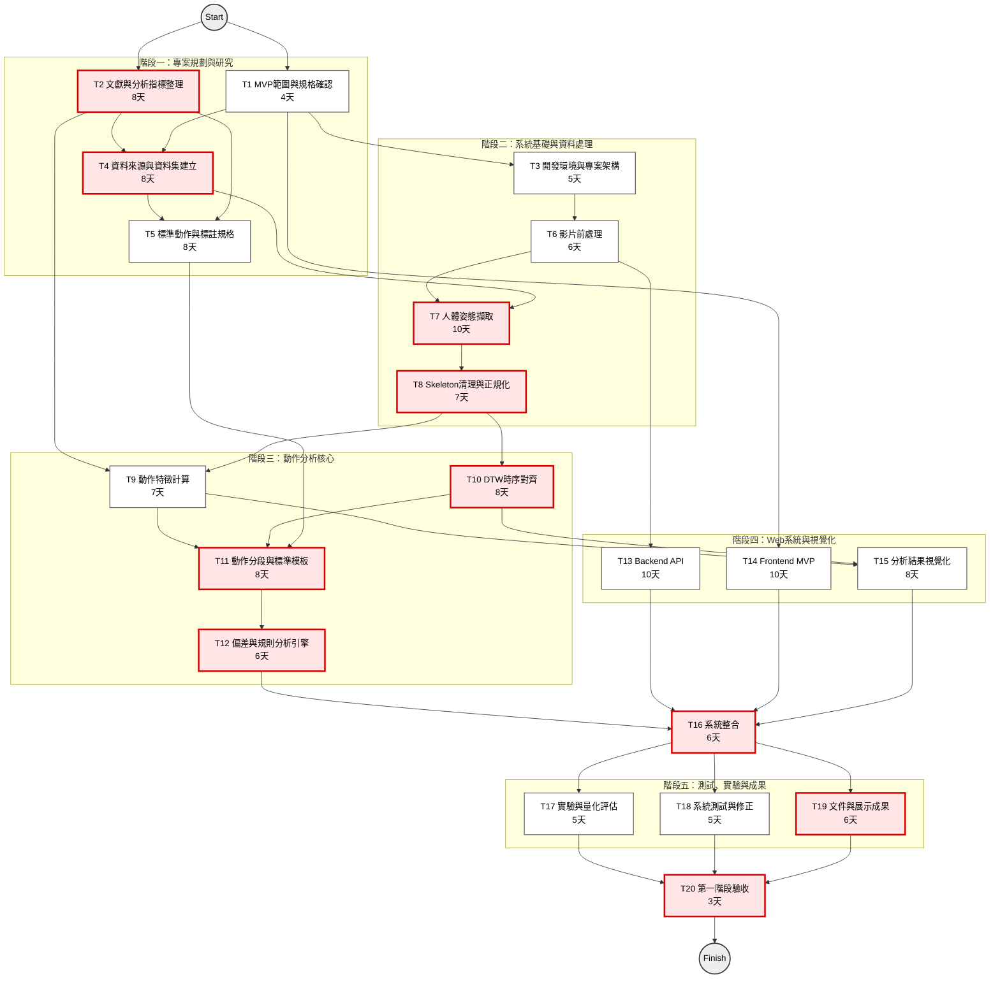
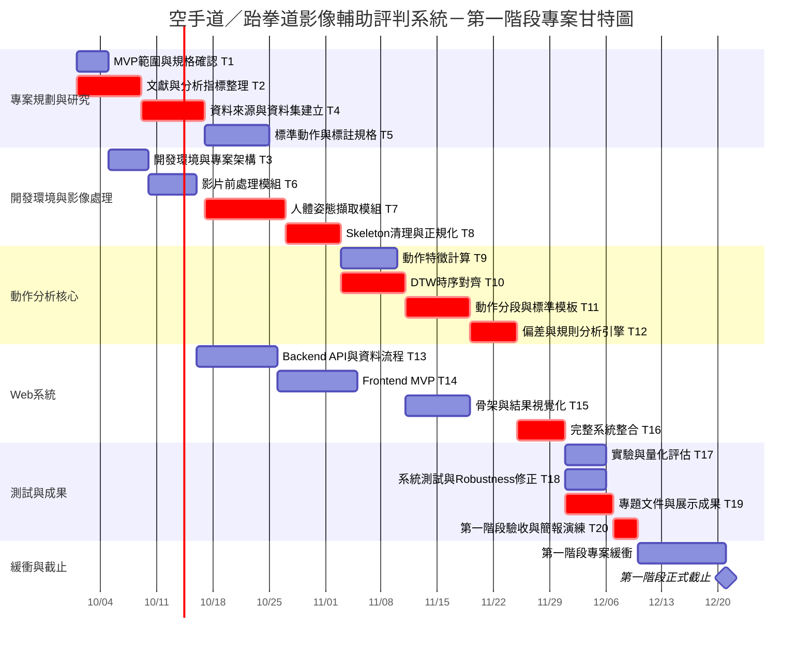

# 小組作業2

## 專題個別組員任務、PERT/CPM圖與甘特圖

| 編號  | 任務名稱                | 主要負責      | 預估需時 | 前置任務            | 預計開始   | 預計結束   |
|-------|---------------------|-----------|------|---------------------|-----------|-----------|
| T1  | 專題範圍與MVP確認    | A；B/C共同   | 4天   | 無               | 10月1日  | 10月4日  |
| T2  | 文獻、規則與分析指標整理        | B；A協助     | 8天   | 無               | 10月1日  | 10月8日  |
| T3  | 開發環境與專案架構建置         | C         | 5天   | T1              | 10月5日  | 10月9日  |
| T4  | 資料來源調查與資料集建立        | B；A協助     | 8天   | T1、T2           | 10月9日  | 10月16日 |
| T5  | 標準動作與標註規格設計         | B；全員討論    | 8天   | T2、T4           | 10月17日 | 10月24日 |
| T6  | 影片前處理模組             | C         | 6天   | T3              | 10月10日 | 10月15日 |
| T7  | 人體姿態擷取模組            | A         | 10天  | T4、T6           | 10月17日 | 10月26日 |
| T8  | Skeleton 清理與人體正規化   | A         | 7天   | T7              | 10月27日 | 11月2日  |
| T9  | 動作特徵計算模組            | B；A協助     | 7天   | T2、T8           | 11月3日  | 11月9日  |
| T10 | DTW 時序對齊模組          | A         | 8天   | T8              | 11月3日  | 11月10日 |
| T11 | 動作分段與標準模板建立         | B；A協助     | 8天   | T5、T9、T10       | 11月11日 | 11月18日 |
| T12 | 動作偏差與規則分析引擎         | B         | 6天   | T11             | 11月19日 | 11月24日 |
| T13 | Backend API 與資料流程   | C；A協助介面   | 10天  | T6              | 10月16日 | 10月25日 |
| T14 | Frontend MVP        | C         | 10天  | T1、T3           | 10月26日 | 11月4日  |
| T15 | 骨架與分析結果視覺化          | A；C協助     | 8天   | T9、T10          | 11月11日 | 11月18日 |
| T16 | 系統整合                | C；A/B共同   | 6天   | T12、T13、T14、T15 | 11月25日 | 11月30日 |
| T17 | 實驗與量化評估             | B；A協助     | 5天   | T16             | 12月1日  | 12月5日  |
| T18 | 系統測試與 Robustness 修正 | A；C協助     | 5天   | T16             | 12月1日  | 12月5日  |
| T19 | 專題文件與展示成果整理         | C；A/B提供內容 | 6天   | T16             | 12月1日  | 12月6日  |
| T20 | 第一階段驗收與簡報演練         | A主責；全員    | 3天   | T17、T18、T19     | 12月7日  | 12月9日  |

12/10～12/21：
不再安排新的核心功能。
這 12 天保留作為：
- 指導教授回饋修改
- 臨時 Bug 修正
- 實驗數據補跑
- 文件修改
- Demo 備援
- 簡報／報告最終版
- 第一階段正式截止緩衝

## PERT / CPM圖

## 甘特圖

